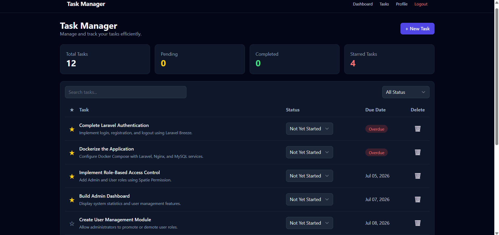
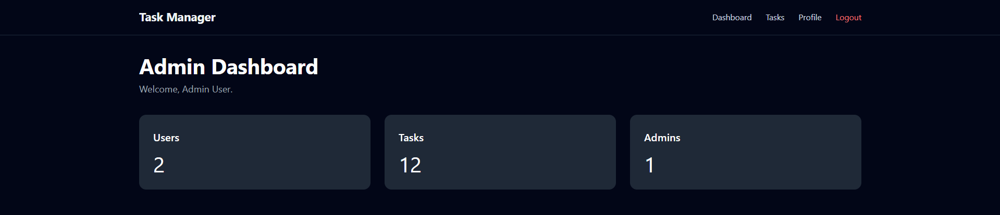
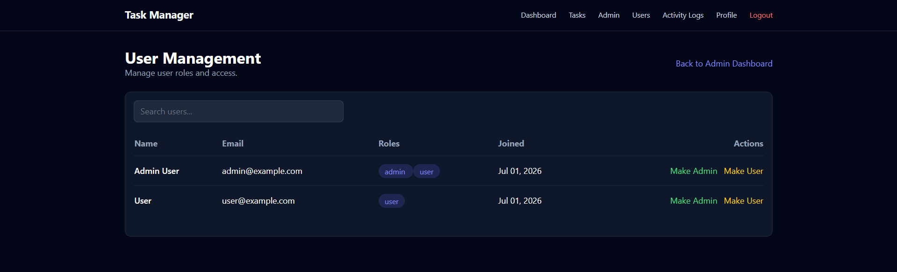
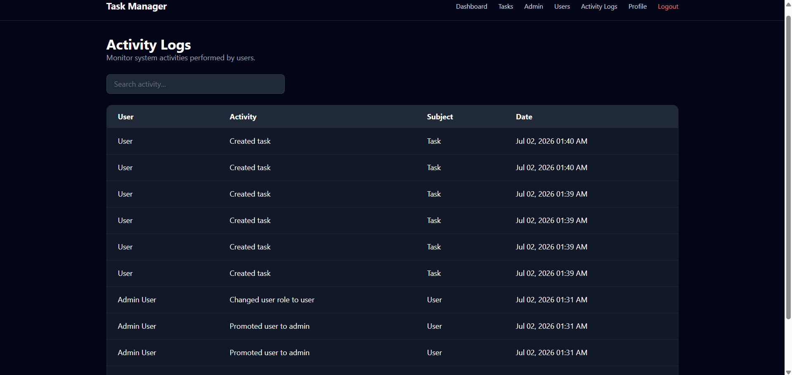

# Laravel Docker Task Management System

A Task Management System built with **Laravel 12**, **Livewire**, **Docker**, **MySQL**, and **Spatie** packages. This project demonstrates authentication, task management, role-based access control, activity logging, and containerized deployment.

---

# Features

### Authentication
- User Registration
- User Login & Logout
- User Profile Management

### Task Management
- Create Tasks
- View Tasks
- Delete Tasks
- Update Task Status
- Star / Unstar Tasks
- Search Tasks
- Filter Tasks
- Dashboard Statistics

### Administration
- Admin Dashboard
- User Management
- Role-Based Access Control (Admin/User)
- Protected Admin Routes

### Activity Logging
- Log task creation
- Log task deletion
- Log task status updates
- Log starred/unstarred tasks
- Log user role changes

### Docker
- Laravel Application Container
- Nginx Container
- MySQL Container
- Automatic Database Migration
- Automatic Frontend Asset Build

---
# Preview

### User Dashboard



### Admin Dashboard



### User Management



### Activity Logs



---

# Tech Stack

| Category | Technology |
|----------|------------|
| Backend | Laravel 12 |
| Frontend | Livewire 3, Blade, Tailwind CSS |
| Authentication | Laravel Breeze |
| Database | MySQL 8 |
| Web Server | Nginx |
| Containerization | Docker & Docker Compose |
| Build Tool | Vite |
| Permissions | Spatie Laravel Permission |
| Activity Logs | Spatie Laravel Activity Log |

---

# Built With

| Tool | Purpose |
|------|---------|
| PHP 8.4 | Backend Language |
| Composer | Dependency Management |
| Docker | Containerization |
| Docker Compose | Multi-container Orchestration |
| MySQL | Database |
| Nginx | Web Server |
| Livewire | Reactive UI Components |
| Tailwind CSS | User Interface |
| Vite | Frontend Asset Bundling |
| Git | Version Control |
| GitHub | Source Code Hosting |

---

# Requirements

Before running the project, make sure you have installed:

- Docker Desktop
- Docker Compose
- Git

---

# Quick Start

## Clone the Repository

```bash
git clone https://github.com/shervss/laravel_docker.git
```

```bash
cd laravel_docker
```

## Copy the Environment File

Linux / WSL

```bash
cp .env.example .env
```

Windows PowerShell

```powershell
copy .env.example .env
```

## Build the Containers (First Time Only)

```bash
docker compose up --build -d
```

## Start the Containers (Subsequent Runs)

```bash
docker compose up -d
```

## Restart the Laravel Application and Nginx

> If the application does not load (e.g., **502 Bad Gateway**) after starting the containers, restart the application services.

```bash
docker compose restart app nginx
```

## Generate the Application Key

```bash
docker exec -it laravel_docker_app php artisan key:generate
```

## Run Database Migrations

```bash
docker exec -it laravel_docker_app php artisan migrate
```

## Seed the Database

```bash
docker exec -it laravel_docker_app php artisan db:seed
```

## Page Access

| Page | URL | Access |
|------|-----|--------|
| Welcome | `http://localhost:8000/` | Public |
| Login | `http://localhost:8000/login` | Public |
| Register | `http://localhost:8000/register` | Public |
| Dashboard | `http://localhost:8000/dashboard` | Authenticated Users |
| Tasks | `http://localhost:8000/tasks` | Authenticated Users |
| Profile | `http://localhost:8000/profile` | Authenticated Users |
| Admin Dashboard | `http://localhost:8000/admin` | Admin Only |
| User Management | `http://localhost:8000/admin/users` | Admin Only |
| Activity Logs | `http://localhost:8000/admin/activity-logs` | Admin Only |

---

# Test Accounts

| Role | Email | Password |
|------|-------|----------|
| Admin | admin@example.com | password |
| User | test@example.com | password |

---

# Project Architecture

## Project Structure

```
app/
├── Livewire/
│   ├── Pages/
│   │   ├── Admin/
│   │   └── Tasks/
│   └── ...
├── Models/
├── Providers/

bootstrap/
config/
database/
docker/
public/
resources/
routes/
storage/
```

---

## Key Files

| File | Description |
|------|-------------|
| routes/web.php | Web application routes |
| app/Models/Task.php | Task model |
| app/Models/User.php | User model with roles |
| app/Livewire/Pages/Tasks/Index.php | Task Management component |
| app/Livewire/Pages/Admin/Dashboard.php | Admin Dashboard |
| app/Livewire/Pages/Admin/Users/Index.php | User Management |
| docker-compose.yml | Docker services |
| Dockerfile | PHP application image |
| nginx/default.conf | Nginx configuration |

---

# Docker Containers

| Container | Purpose |
|-----------|---------|
| laravel_docker_app | Laravel PHP Application |
| laravel_docker_nginx | Nginx Web Server |
| laravel_docker_mysql | MySQL Database |

---

# Containerization

The application is containerized using Docker Compose.

Services include:

- Laravel PHP Application
- Nginx Web Server
- MySQL Database

During startup, the application automatically:

- Builds frontend assets using Vite
- Waits for the MySQL database to become available
- Runs pending database migrations
- Clears Laravel caches
- Starts PHP-FPM

---

# Useful Commands

## Start Containers

```bash
docker compose up -d
```

## Stop Containers

```bash
docker compose down
```

## Rebuild Containers

```bash
docker compose up --build -d
```

## Build the Containers (First Time Only)

```bash
docker compose up --build -d
```

## Start the Containers (Subsequent Runs)

```bash
docker compose up -d
```

## Restart the Laravel Application and Nginx

> If the application does not load (e.g., **502 Bad Gateway**) after starting the containers, restart the application services.

```bash
docker compose restart app nginx
```

## View Running Containers

```bash
docker ps
```

## View Application Logs

```bash
docker logs laravel_docker_app
```

## Enter the Laravel Container

```bash
docker exec -it laravel_docker_app bash
```

## Run Migrations

```bash
docker exec -it laravel_docker_app php artisan migrate
```

## Seed the Database

```bash
docker exec -it laravel_docker_app php artisan db:seed
```

## Clear Laravel Cache

```bash
docker exec -it laravel_docker_app php artisan optimize:clear
```

---

# License

This project is licensed under the MIT License.
